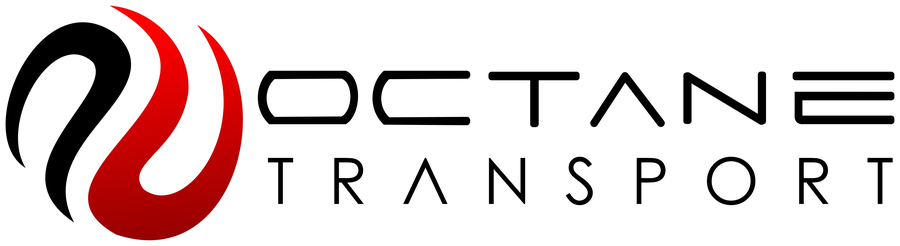
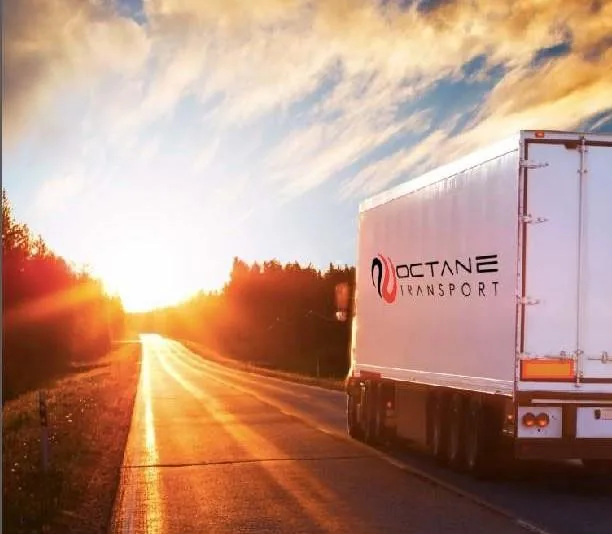
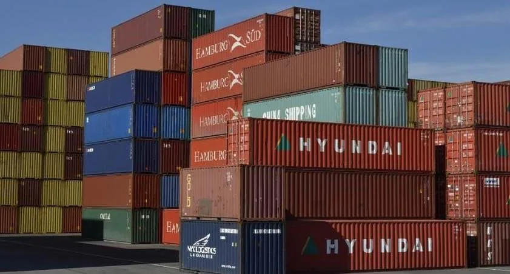
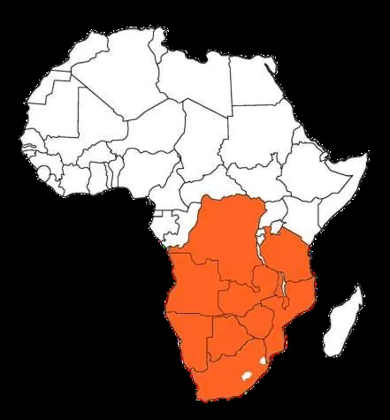
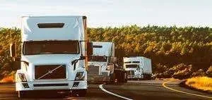

<div align="center">



# CORPORATE PROFILE

**Transportation · Logistics · General Supply**
Ndola, Zambia — Serving Zambia and the SADC Region

</div>

---

**Address:** 19 Kafironda Drive, Itawa, Ndola, Zambia
**Email:** info@octanetransport.com · abdihakim.mohamed@octanetransport.com
**Mobile:** +260 973 821 013
**Web:** www.octanetransport.com

---

## Table of Contents

1. [Executive Summary & Corporate Foundations](#section-1-executive-summary--corporate-foundations)
2. [Operational Capabilities & Infrastructure](#section-2-operational-capabilities--infrastructure)
3. [Corporate Governance, Risk & Compliance](#section-3-corporate-governance-risk--compliance)
4. [Strategic Growth & Commercial Engagement](#section-4-strategic-growth--commercial-engagement)

---

## Section 1: Executive Summary & Corporate Foundations



### 1.1 Executive Statement

Octane Transport Limited is a privately owned Zambian transportation, logistics and general supply company headquartered in Ndola, in the heart of the Copperbelt Province. The company moves cargo and equipment for corporate, industrial and mining-sector clients across Zambia and the wider SADC region, consolidating supply, logistics and haulage capability under a single accountable operator.

> **Positioning Statement:** Octane Transport exists to give corporate, industrial and mining-sector clients one dependable partner for the movement and supply of goods — reducing vendor complexity while protecting delivery timelines, cargo integrity and compliance standing.

Operating from Zambia's principal mining and industrial corridor, the company is structurally positioned to serve the material, equipment and freight requirements of the Copperbelt's mining, engineering and heavy-industry base, while maintaining an established transport network reaching customers throughout the SADC region.

### 1.2 Corporate Identity

**Mission, Vision & Values.** Octane Transport's day-to-day operations are governed by a clear operational philosophy rather than by generic slogans. Formal mission and vision statements are in the process of being finalized by management; in their place, the company's published purpose, direction and values — set out below — describe how Octane Transport operates for its clients today.

| Pillar | Statement |
|---|---|
| **Purpose** | To provide dependable transportation, logistics and supply solutions that get clients' goods to their destination safely and on time, throughout Zambia and the SADC region. |
| **Direction** | To keep building operating capacity and regional reach, backed by a qualified, experienced team, in order to support a growing base of corporate, industrial and mining-sector clients. |
| **Values** | Reliability and on-time delivery · Compliance-minded operations · Long-term client relationships |

> **Operational Philosophy:** Octane Transport pursues long-term relationship building over transactional engagements — prioritizing clear communication, compliant paperwork and insurance protocols, real-time cargo visibility, and treating every consignment as a priority, whether the client is a wholesaler, contractor, industrial supplier or mining-sector operator.

### 1.3 Company Overview & Background

| Attribute | Detail |
|---|---|
| **Legal / Trading Name** | Octane Transport Limited |
| **Ownership Structure** | Privately owned Zambian company |
| **Headquarters** | 19 Kafironda Drive, Itawa, Ndola, Zambia |
| **Regional Base** | Copperbelt Province — Zambia's principal mining and industrial region |
| **Operating Territory** | Zambia and the wider SADC (Southern African Development Community) region |
| **Core Business** | Transportation, logistics and general supply solutions |
| **Client Base** | Corporate, industrial, mining-sector, agribusiness, engineering and logistics-sector clients |

Octane Transport operates with substantial operating capacity, powered by a team of qualified staff with considerable experience in the transport and logistics industry. The company transports equipment and supplies throughout Zambia and the SADC region, with an operating model built around ensuring that client goods arrive safely and on time at their destination.

> **Procurement Note:** Formal incorporation details, statutory registration and licensing documentation are available on request through Octane Transport's office as part of vendor registration or tender due diligence (see [Section 3.2](#32-regulatory-compliance-legal-framework--documentation)).

---

## Section 2: Operational Capabilities & Infrastructure



### 2.1 Core Services Breakdown

Octane Transport delivers a full-service capability spanning general supply, logistics, cargo transportation, shipment visibility and road transportation — engineered to reduce the number of vendors a client's procurement function needs to manage.

| # | Service Line | Scope of Work | Commercial Value |
|---|---|---|---|
| 01 | **General Supply** | Supply of building and construction materials, mining and industrial equipment, general office and hospital consumables, civil works, engineering fabrication and PPE attire. | A single, accountable supplier for materials, equipment and safety attire — reducing vendor-management overhead. |
| 02 | **Logistics** | End-to-end consignment management: documentation, paperwork processing and compliant insurance protocols, planned and confirmed ahead of every movement. | Proactive documentation and insurance compliance lowers risk and delay at every handover point. |
| 03 | **Cargo Transportation** | Cargo transportation throughout Zambia and the SADC region for wholesalers, growers in the produce industry, and engineering-sector clients, run on a well-serviced truck fleet. | A maintained fleet and regional route experience translates into fewer breakdowns and missed deadlines. |
| 04 | **Real-Time Cargo Tracking** | A tracking system giving clients exact shipment location data and immediate notification of any delays. | Full shipment visibility lets client operations and procurement teams plan with confidence. |
| 05 | **Road Transportation** | Movement of farm equipment and general supplies nationwide, from one side of the country to the other. | Flexible, nationwide road transport capability for equipment and general supplies. |

**Service Workflow — Enquiry to Delivery**

```
Enquiry & Scoping  →  Planning & Documentation  →  Transport & Tracking  →  Delivery & Follow-Up
   Cargo, route         Paperwork prepared,           Cargo moves on          Goods arrive safely
   and timeline         insurance protocols            Octane's fleet with     and on time; team
   captured             confirmed pre-movement          real-time tracking     remains the ongoing
                                                                                point of contact
```

### 2.2 Asset & Fleet Operations

> **Procurement Note:** In line with Octane Transport's commitment to accuracy, fleet capability is described below by category rather than by specific unit counts or vehicle models. A detailed fleet register — vehicle types, capacities and unit numbers — is available on request as part of vendor registration or tender due diligence.

| Fleet Category | Function | Maintenance Standard |
|---|---|---|
| **Cargo Trucks & Trailers** | Configured for general and bulk cargo movement; used for produce, engineering and industrial consignments across Zambia and the SADC region. | Maintained on a scheduled service programme designed to minimize breakdowns and protect delivery schedules. |
| **General Supply & Equipment Sourcing** | Sourcing and delivery of building and construction materials, mining and industrial equipment, PPE attire and consumables — backed by in-house civil works and engineering fabrication capability. | Managed through the General Supply service line, independent of the transport fleet. |
| **Tracking & Logistics Technology** | Real-time cargo tracking infrastructure providing location visibility and early delay notification across every shipment. | Supported by the logistics team, which manages documentation and insurance compliance ahead of each movement. |


*Detailed unit-level fleet schedule (vehicle types, load capacities, registration data) to be inserted once released for external distribution — available on request during procurement engagement.*

### 2.3 Operational Footprint & Technology Integration



Octane Transport's operational footprint is anchored in Ndola, Copperbelt Province, with an established road transport network extending across Zambia and into the broader SADC region — connecting suppliers, industrial sites and clients across national borders.

| Footprint Element | Detail |
|---|---|
| **Home Base** | Ndola, Copperbelt Province, Zambia |
| **Primary Operating Territory** | Zambia (nationwide) |
| **Extended Network** | SADC region, via an established cross-border road transport network |
| **Technology Backbone** | Real-time cargo tracking system covering location data and delay alerts |
| **Compliance Infrastructure** | Documentation and insurance-protocol management integrated into every consignment |

**Selected Industries Served**

| Industry | Engagement |
|---|---|
|  **Agribusiness** | Road transportation and cargo services for farm equipment, produce and agricultural supplies, connecting wholesalers and growers with their markets on time. |
|  **Engineering** | Cargo transportation, civil works, engineering fabrication and general supply for engineering-sector clients and construction sites. |
|  **Food & Beverage** | Reliable, trackable cargo transportation that keeps production and distribution schedules on time. |
|  **Plastics & Packaging** | Cargo transportation and general supply support for materials and finished-goods movement. |
|  **General Logistics** | End-to-end logistics support — documentation, insurance compliance, cargo transportation and real-time tracking — for logistics partners across the region. |

> **Copperbelt Positioning:** Headquartered at the heart of Zambia's mining region, Octane Transport is structurally positioned to support mining, engineering and heavy-industry clients through its General Supply and Cargo Transportation service lines, with an existing client base already operating in the logistics and petroleum sectors.

---

## Section 3: Corporate Governance, Risk & Compliance

### 3.1 Leadership Structure & Key Management

Octane Transport is a privately owned and privately managed company. Day-to-day client and corporate correspondence is coordinated through the company's principal contact channel:

| Contact | Role | Details |
|---|---|---|
| **Abdihakim Mohamed** | Principal Corporate Contact | abdihakim.mohamed@octanetransport.com |
| **General Enquiries** | Client Service Desk | info@octanetransport.com · +260 973 821 013 |


*A full leadership biography set and organizational chart are not published externally at this time and are available on request during formal partnership, vendor or investor due diligence.*

### 3.2 Regulatory Compliance, Legal Framework & Documentation

Octane Transport manages documentation and compliant insurance protocols as a standard part of its Logistics service line. For formal vendor registration, tender or institutional due diligence, the following documentation categories are maintained and can be made available on application:

| Document Category | Status |
|---|---|
| Certificate of Incorporation / Company Registration | Available on request |
| Tax Registration (ZRA TPIN) | Available on request |
| NAPSA & Workers' Compensation Fund Registration | Available on request |
| Applicable Road Transport / Operating Licences | Available on request |
| Insurance Certificates | Available on request |
| HSE Policy & Safety Documentation | Available on request |

> **Governance Note:** Octane Transport does not currently publish formal HSE certifications (such as ISO 45001 or ISO 14001) externally. Current HSE policy documentation, safety records and compliance certificates are released to authorized clients, procurement teams and prospective partners upon a reviewed request, in view of the confidential and sensitive nature of certain records.

### 3.3 Risk Management & Quality Assurance Protocols

| Control Area | Practice |
|---|---|
| **Insurance & Documentation** | Every consignment is planned with paperwork and compliant insurance protocols considered ahead of movement. |
| **Shipment Monitoring** | Real-time cargo tracking supports proactive awareness of delays, enabling on-road risk and schedule impacts to be managed as they arise. |
| **Fleet Integrity** | A scheduled maintenance programme reduces the operational and safety risk associated with poorly maintained vehicles. |
| **Personnel Standards** | A team of highly qualified staff with considerable industry experience underpins safer, more predictable operations. |
| **PPE & Safety Supply** | The General Supply service line includes PPE attire, extending a safety-conscious standard to the clients Octane equips. |
| **Route & Environmental Planning** | A well-maintained fleet and planned routing reduce unnecessary breakdowns and detours — a practical control on both cost and environmental impact. |

---

## Section 4: Strategic Growth & Commercial Engagement



### 4.1 Competitive Advantages & Value Proposition

| Advantage | Why It Matters to Clients |
|---|---|
| **Established Zambian Operator** | Privately owned, headquartered in Ndola with local knowledge of Zambian and regional routes. |
| **Regional Reach** | Cargo transportation throughout Zambia and the wider SADC region on an established transport network. |
| **Full-Service Capability** | General supply, logistics, cargo transportation, real-time tracking and road transportation under one accountable vendor. |
| **Experienced, Qualified Team** | Highly qualified staff with considerable experience in the transport and logistics industry. |
| **Real-Time Cargo Visibility** | Exact shipment location data and early delay awareness for confident operations planning. |
| **Compliance-Minded Logistics** | Paperwork and compliant insurance protocols managed proactively ahead of every consignment. |
| **Trusted Client Base** | Working relationships with logistics and petroleum-sector clients, including those referenced in [Section 4.2](#42-client-portfolio). |
| **Long-Term Partnership Approach** | A relationship-building model aimed at lasting business partnerships rather than one-off transactions. |

### 4.2 Client Portfolio

Some of the clients Octane Transport has worked with include, but are not limited to:

| Client | Relationship |
|---|---|
| Reload Logistics | Logistics Partner |
| Impala Terminals | Logistics Partner |
| Hass Petroleum | Logistics / Petroleum-Sector Partner |
| Polytra Zambia | Logistics Partner |
| World Co. Logistics | Logistics Partner |
| Logistra Africa | Logistics Partner |

### 4.3 Strategic Growth Roadmap & Expansion Vision

Octane Transport's stated strategic direction is to keep building operating capacity and regional reach, backed by a qualified, experienced team, in order to support a growing base of corporate, industrial and mining-sector clients across Zambia and the SADC region. This translates into three ongoing priorities:

1. **Capacity Growth** — expanding fleet and supply capability to serve a larger volume of corporate, industrial and mining-sector consignments.
2. **Regional Depth** — deepening the existing SADC transport network to support cross-border client operations.
3. **Partnership Retention** — reinforcing the long-term relationship model that already underpins the company's logistics and petroleum-sector client base.

> **For Procurement & Supply-Chain Teams:** Engaging Octane Transport consolidates general supply, logistics, cargo transportation and shipment tracking into a single vendor relationship — meaning fewer suppliers to manage, clearer documentation, visible cargo status, and a team invested in the relationship beyond a single shipment.

### 4.4 Engagement Process

| Step | Description |
|---|---|
| **1. Initial Enquiry** | Share the requirement — cargo type, route, volume and timeline — via the contact form, phone or email. |
| **2. Scoping & Documentation** | Octane confirms scope, paperwork and compliant insurance protocols, and shares relevant compliance documentation. |
| **3. Proposal & Agreement** | A tailored quote is provided and terms are agreed, whether for a one-off consignment or an ongoing account. |
| **4. Onboarding & Delivery** | Cargo moves on Octane's fleet with real-time tracking; the team remains the client's point of contact for future needs. |

### 4.5 Call to Action

> **Ready to Build a Long-Term Partnership?**
> Whether you require a transportation quote, wish to register Octane Transport as a vendor, or need corporate, statutory, insurance or HSE documentation for procurement due diligence — our team is ready to respond.

**Full Corporate Contact Information**

| Channel | Detail |
|---|---|
| **Registered Office** | 19 Kafironda Drive, Itawa, Ndola, Zambia |
| **General Enquiries** | info@octanetransport.com |
| **Principal Contact** | abdihakim.mohamed@octanetransport.com |
| **Mobile** | +260 973 821 013 |
| **Website** | www.octanetransport.com |

---

<div align="center">


**www.octanetransport.com**
*Reliable Transportation, Logistics & Supply Solutions — Zambia & the SADC Region*

</div>
